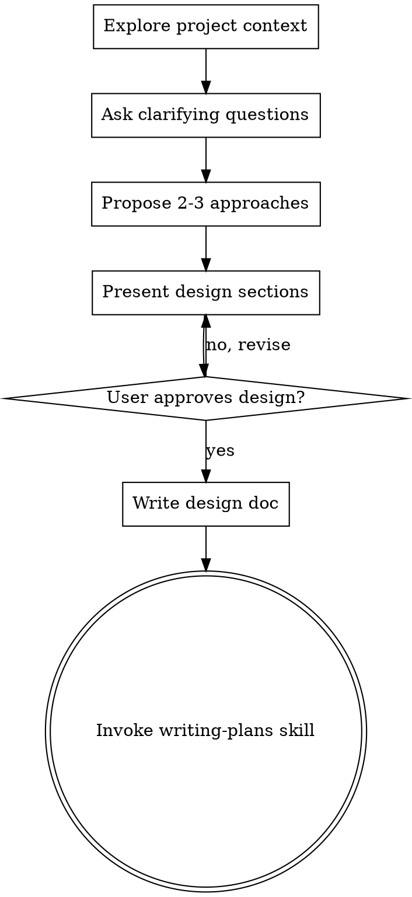

## Context Transfer from Claude Session

**IMPORTANT**: This is a context handoff from a Claude session.
The previous AI assistant completed the work described below.
Please review and continue from where it left off.

**Source Provider**: Claude
**Source Session**: be3f9b51-ff31-48b5-9839-58bec4639b0a
**Transferred**: 2026-02-19 11:56:53
**Conversations**: 19

---

### Session Activity Summary

**Tool Calls:**

- Bash: 448
- Read: 146
- Edit: 46
- Write: 29
- Glob: 21
- Skill: 20
- WebSearch: 13
- TaskUpdate: 11
- TaskOutput: 11
- mcp**plugin_playwright_playwright**browser_run_code: 8
- TaskCreate: 6
- mcp**plugin_playwright_playwright**browser_take_screenshot: 6
- Task: 5
- mcp**plugin_playwright_playwright**browser_navigate: 4
- WebFetch: 3
- Grep: 3
- TaskStop: 1
- mcp**plugin_playwright_playwright**browser_install: 1

**Files Created/Written:**

- `E:\mcp\CLAUDE.md`
- `E:\mcp\docs\plans\2026-02-15-mcp-hub-design.md`
- `docs\plans\2026-02-15-mcp-hub-design.md`
- `docs\plans\2026-02-16-mcp-hub-implementation-plan.md`
- `E:\mcp\docs\plans\2026-02-16-mcp-hub-implementation-plan.md`
- `docs\plans\2026-02-16-phase-0-setup.md`
- `E:\mcp\docs\plans\2026-02-16-phase-0-setup.md`
- `docs\plans\2026-02-16-phase-1-skeleton.md`
- `E:\mcp\docs\plans\2026-02-16-phase-1-skeleton.md`
- `docs\plans\2026-02-16-phase-2-ai-engine.md`
- `E:\mcp\docs\plans\2026-02-16-phase-2-ai-engine.md`
- `docs\plans\2026-02-16-phase-3-6-summary.md`
- `E:\mcp\docs\plans\2026-02-16-phase-3-6-summary.md`
- `E:\mcp\docs\plans\2026-02-17-mcp-claw-architecture-update.md`
- `docs\plans\2026-02-17-mcp-claw-architecture-update.md`
- ... and 42 more

**Files Read:**

- `E:\mcp\package.json`
- `E:\mcp\01_PRD_MCP_Hub.md`
- `E:\mcp\02_Tech_Selection_MCP_Hub.md`
- `E:\mcp\03_API_Plan_MCP_Hub.md`
- `E:\mcp\04_Flow_Scenarios_MCP_Hub.md`
- `E:\mcp\demo\app.js`
- `E:\mcp\demo\index.html`
- `E:\mcp\SGA-Molt-Requirements.md`
- `E:\mcp\SGA-Molt-MCP-Hub-Requirements.md`
- `E:\mcp\demo\styles.css`
- ... and 100 more

**Tasks:** 6/6 completed

**Recent Tool Executions:**

- **Bash** ❌
  - Input: ping gemini 2>&1 | head -5
  - Result: `Exit code 1`
- **Bash** ❌
  - Input: gping 2>&1 | head -5
  - Result: `Exit code 1`
- **Bash**
  - Input: TMPFILE1=$(mktemp) && cat > "$TMPFILE1" << 'MSGEOF'
    [TASK-A] 后端：新增工具调用追踪 + Dashb...
  - Result: `Command running in background with ID: bda8ab2. Output is being written to: C:\Users\Administrator\AppData\Local\Temp\claude\E--mcp\tasks\bda8ab2.outp...`
- **Task**
  - Result: `[{'type': 'text', 'text': 'Async agent launched successfully.\nagentId: ac3b37a (internal ID - do not mention to user. Use to resume later if needed.)...`
- **TaskOutput**
  - Result: `<retrieval_status>success</retrieval_status>  <task_id>bda8ab2</task_id>  <task_type>local_bash</task_type>  <status>failed</status>  <exit_code>1</ex...`
- ... and 777 more

---

### Previous Conversation Context

#### Turn 1

**User**: This session is being continued from a previous conversation that ran out of context. The summary below covers the earlier portion of the conversation.

Analysis:
Let me analyze this conversation chronologically to create a comprehensive summary.

**Session Context:**
This session was a continuation from a previous context. The summary at the beginning describes all completed phases (0-6) and the current state: OpenRouter LLM was wired in (commit `ec576f4`), backend build was failing due to `rootDir` TypeScript error.

**Key work done in this session:**

1. **Backend TypeScript Build Fix** - Fixed `rootDir` error by:
   - Creating `packages/backend/tsconfig.build.json`
   - Updating `packages/backend/tsconfig.json` to override paths pointing to dist files
   - Updating `packages/backend/package.json` build script to use `tsconfig.build.json`

2. **Backend Started Successfully** - Started with `.env` file, added `MASTER_KEY_FILE` env var

3. **AI Engine Settings UI** - Gemini completed `AiEngineSettings.vue` with real model list

4. **CLI config command** - Codex added `config.command.ts` with show/set/test subcommands

5. **CCB ask workflow debugging** - Major debugging session:
   - `ask codex < "$TMPFILE"` was wrong (ask ignores stdin)
   - `cask` daemon was down
   - Correct method: `ask codex "$(cat $TMPFILE)"`
   - Updated memory file

6. **prompt-builder.ts fix** - Fixed so LLM gets proper instructions with `===FILE===` format

7. **CLI → Backend monitoring** - Major feature:
   - Backend: 4 new monitor endpoints (POST cli-runs, POST events, GET runs, GET SSE events)
   - CLI: `--report-to <url>` option
   - Frontend: CLI Agent Runs panel in MonitorView.vue

8. **Integration test** - Full end-to-end test passed, screenshot shows CLI runs in monitor

9. **User's last question** - About demo prototype UI vs current frontend aesthetics

**User messages (key ones):**

- "你前端有做可以配置模型的界面吧"
- "你让codex去测一下"
- "我感觉你叫codex的命令又搞错了"
- "还是不对 之前的都调用的好好的 我真是服了"
- "好的 我重启了一下 继续吧"
- "先把cli打通到后端监控"
- "做一次完整的集成测试"
- "大哥 你现在这个前端 和demo目录里面我前端的原型 会不会差距比较大？我说的不是功能 单纯从ui啊 美观的角度 来说"

**Demo prototype analysis:**

- Inter font, dark sidebar (#1e293b), clean white cards
- Custom CSS with topology view (orbit animation), deployment terminal, audit drawer
- More polished visual design than Ant Design Vue defaults
- Gap: current frontend uses generic Ant Design Vue components vs the demo's custom-crafted design

**Pending task:**
The last user message was asking about UI/aesthetics comparison between demo and current frontend. I just read the demo files and haven't responded yet (the summary was requested mid-response).

Summary:

1. Primary Request and Intent:
   - **Session continuation**: Resume from previous context where backend build was failing (`rootDir` TypeScript error after wiring OpenRouter LLM in commit `ec576f4`)
   - **Build/startup**: Fix backend TypeScript build, add missing env vars (`MASTER_KEY_FILE`), start backend
   - **Model configuration UI**: Complete `AiEngineSettings.vue` with real OpenRouter model list (8 models), localStorage persistence, connectivity test
   - **CLI config command**: Add `mcp-claw config show/set/test` subcommands for `.env` management
   - **OpenRouter model testing**: Verify which models are actually callable (`openai/gpt-5.2-codex`, `openai/gpt-5.1-codex`, `anthropic/claude-haiku-4.5`, `google/gemini-3-flash-preview`)
   - **prompt-builder fix**: Fix `buildCodegenPrompt()` which sent only 4 lines of metadata — LLM was returning conversational text instead of `===FILE===` formatted code
   - **CLI → Backend monitoring**: Design and implement full pipeline: `mcp-claw run --report-to <url>` → backend stores runs + SSE fanout → frontend Monitor page shows CLI Agent Runs panel
   - **Integration test**: Full end-to-end test of the CLI→backend→frontend chain
   - **UI/aesthetics review**: User asked how current frontend compares aesthetically to their `demo/` prototype (unanswered — summary triggered mid-response)

2. Key Technical Concepts:
   - **TypeScript monorepo `rootDir` constraint**: When `tsconfig.base.json` maps `@mcp-claw/core` to source files, backend `rootDir: "."` rejects files outside its directory; fix by overriding `paths` in backend tsconfig to point to `dist/`
   - **tsconfig.build.json pattern**: Separate build config (excludes test files, sets `rootDir: "src"`) vs `tsconfig.json` (includes tests for IDE)
   - **CCB ask workflow** (CRITICAL correction): `ask codex` takes message as CLI argument, NOT stdin. `ask codex < file` is WRONG. Correct: `ask codex "$(cat $TMPFILE)"`. `cask` daemon was also found to be down — `ask codex "msg"` bypasses it directly
   - **OpenRouter models confirmed working**: `openai/gpt-5.2-codex` ✅, `anthropic/claude-haiku-4.5` ✅, `google/gemini-3-flash-preview` ✅; `openai/gpt-5.1-codex-max` ❌ (doesn't exist), `openai/gpt-5.1-codex` ✅
   - **Codegen `===FILE===` format**: `parseGeneratedFiles()` splits on `===FILE===` delimiter; `buildCodegenPrompt()` must explicitly instruct LLM to use this format with few-shot examples
   - **NestJS SSE with rxjs**: `@Sse` decorator returns `Observable<MessageEvent>`; `Subject<SseEvent>` per run for live fanout + history replay
   - **CLI reporting**: `runCommand` optionally POSTs to `/api/monitor/cli-runs` to create run, then POSTs `SseEvent` objects for start/done/error; network failures silently caught
   - **Auth guard whitelist prefix match**: `/api/monitor/cli-runs` added to allow unauthenticated CLI reporting
   - **Demo prototype**: Custom CSS, Inter font, dark sidebar (#1e293b), topology view with orbit animation, custom table/card/drawer design — notably more polished than Ant Design Vue defaults

3. Files and Code Sections:
   - **`packages/backend/tsconfig.json`** — Fixed `rootDir` by overriding `paths` to dist:

     ```json
     {
       "extends": "../../tsconfig.base.json",
       "compilerOptions": {
         "rootDir": ".",
         "outDir": "dist",
         "experimentalDecorators": true,
         "emitDecoratorMetadata": true,
         "paths": {
           "@mcp-claw/shared": ["packages/shared/dist/types/api"],
           "@mcp-claw/shared/*": ["packages/shared/dist/*"],
           "@mcp-claw/core": ["packages/core/dist/index"],
           "@mcp-claw/core/*": ["packages/core/dist/*"]
         }
       },
       "include": ["src/**/*.ts", "test/**/*.ts"]
     }
     ```

   - **`packages/backend/tsconfig.build.json`** (NEW) — Production build excludes tests:

     ```json
     {
       "extends": "./tsconfig.json",
       "compilerOptions": { "rootDir": "src" },
       "exclude": ["**/*.spec.ts", "test/**/*", "jest.config.ts"]
     }
     ```

   - **`packages/backend/package.json`** — Changed `"build": "tsc -p tsconfig.build.json"`

   - **`.env`** — Added `MASTER_KEY_FILE=E:/mcp/.secrets/master.key` and `PORT=8080`

   - **`packages/frontend/src/views/Settings/AiEngineSettings.vue`** — Gemini rewrote with 8 real models, localStorage, Agent model field, connectivity test button

   - **`packages/cli/src/commands/config.command.ts`** (NEW) — Codex created:
     - `mcp-claw config show` — reads `.env`, colorized table output
     - `mcp-claw config set --parser/--coder/--agent/--key` — writes back to `.env`, validates against allowed model list
     - `mcp-claw config test` — real OpenRouter fetch, prints ✓/✗

   - **`packages/core/src/codegen/prompt-builder.ts`** — Codex rewrote to include explicit MCP server generation instructions, full IR projection, strict `===FILE===` output format, few-shot example

   - **`packages/core/jest.config.ts`** — Codex fixed `moduleFileExtensions` order to prefer `.ts` over `.js` (prevents loading stale compiled artifacts)

   - **`packages/backend/src/monitor/monitor.service.ts`** — Codex added:
     - `AgentRun` interface with `events: SseEvent[]`
     - `Map<string, Subject<SseEvent>>` for SSE fanout
     - `createRun(root)`, `appendEvent(runId, event)`, `getRuns()`, `getEvents(runId)`, `getRunSummaries()`

   - **`packages/backend/src/monitor/monitor.controller.ts`** — Codex added:
     - `POST /api/monitor/cli-runs` → creates run
     - `POST /api/monitor/cli-runs/:runId/events` → appends event + fans out
     - `GET /api/monitor/cli-runs` → summary list (no full events)
     - `GET /api/monitor/cli-runs/:runId/events` → `@Sse` Observable with history replay

   - **`packages/backend/src/auth/auth.guard.ts`** — Added prefix match for `/api/monitor/cli-runs`

   - **`packages/cli/src/commands/run.command.ts`** — Added `reportTo?: string` to `RunCommandInput`, POST to backend on start/done/error, silent catch

   - **`packages/cli/src/cli.ts`** — Added `.option('--report-to <url>', 'Backend URL for progress reporting')`

   - **`packages/frontend/src/views/Monitor/MonitorView.vue`** — Codex added CLI Agent Runs card: `a-table` with runId/root/status badge/startedAt/eventCount, expandable row with `EventSource` SSE log panel (terminal-style, auto-scroll), 10s polling

   - **`demo/index.html`** + **`demo/styles.css`** — User's original prototype (just read, not modified):
     - Inter font, `#1e293b` dark sidebar, topology view with CSS orbit animation
     - Custom table/card/drawer components, deploy terminal simulation
     - Significantly more polished visual design than current Ant Design Vue implementation

   - **`C:\Users\Administrator\.claude\projects\E--mcp\memory\ccb-ask-workflow.md`** — Updated with correct ask syntax:
     ```bash
     # ONLY CORRECT METHOD:
     ask codex "short message"
     # OR for long messages:
     TMPFILE=$(mktemp)
     cat > "$TMPFILE" << 'MSGEOF'
     message content
     MSGEOF
     ask codex "$(cat $TMPFILE)"
     # WRONG: ask codex < file  (ask ignores stdin)
     ```

4. Errors and Fixes:
   - **Backend `rootDir` TypeScript error**: `tsconfig.base.json` mapped `@mcp-claw/core` to source files → outside backend `rootDir`. Fixed by overriding `paths` in backend `tsconfig.json` to point to `dist/` files; created `tsconfig.build.json` to exclude test files.

   - **Missing `MINIO_ENDPOINT` and `MASTER_KEY_FILE` env vars**: Backend crashed on startup. Created `.secrets/master.key` with `openssl rand -hex 32`, added both vars to `.env`.

   - **`buildCodegenPrompt()` returned conversational LLM response**: Prompt only sent 4 metadata lines with no format instructions. LLM responded conversationally; `parseGeneratedFiles()` treated entire response as filename. Fixed by Codex rewriting `prompt-builder.ts` with full system prompt, IR details, strict `===FILE===` format requirement, few-shot examples.

   - **Stale `.js` artifacts in core `src/`**: Jest was loading compiled `.js` files from `src/` instead of TypeScript sources. Codex fixed `moduleFileExtensions` order in `jest.config.ts`.

   - **CCB `ask codex` wrong invocation (repeated error)**:
     - Used `Skill ask` → PowerShell syntax → bash failure
     - Used `ask codex < "$TMPFILE"` → ask ignores stdin, message was empty
     - Used `echo '...' | ask codex` → pipe inside single quotes, never executed
     - `cask` daemon was down (PID 13820 dead)
     - **Fix**: `ask codex "$(cat $TMPFILE)"` — message as CLI argument. Updated memory file.
     - User feedback: "大哥 你叫codex的命令又错了吧 你反思一下", "完全不行 你陷入循环了 你看看之前是怎么调用的吧"

   - **Gemini pane repeatedly dying on large tasks**: Gemini crashed on all frontend Monitor panel tasks. Applied降级机制: delegated frontend task to Codex instead. Codex succeeded.

   - **pnpm showing exit code 1 on successful builds**: tsc succeeds (no error output) but pnpm reports exit 1. Workaround: verify by checking dist directory existence rather than exit code.

5. Problem Solving:
   - **Identified `openai/gpt-5.2-codex` network error was intermittent**: Earlier Codex test showed NETWORK_ERROR, but direct `node -e fetch(...)` test returned 200 OK. Confirmed model is valid.
   - **End-to-end generation pipeline verified**: `IR → buildCodegenPrompt → LLM → parseGeneratedFiles → [package.json, tsconfig.json, src/client.ts, src/tools/get_users.ts, src/index.ts]` working correctly after prompt-builder fix.
   - **Full CLI→backend→frontend monitoring chain**: Playwright screenshot confirms Monitor page shows `run_1771423662949 | E:/mcp | ● done | 2026-02-18 22:07:42 | 2`, expandable row shows terminal-style log with `[22:07:42] log - CLI run started` and `[22:10:47] done - Run completed`.

6. All User Messages:
   - "你前端有做可以配置模型的界面吧 我印象中 然后现在cli端是有命令行形式还是有个界面 不要啥事都自己干 可以扔给两同事干"
   - "你让codex 再测试一下？测试结果看看"
   - "你让codex再测试一下 我还是贴一个调用的样例给你吧 [...Python sample...] 你让codex去测一下"
   - "没接单"
   - "我感觉你叫codex的命令又搞错了 它都没动 大哥"
   - "你让codex 再测试一下？测试结果看看" (repeated)
   - "还是不对 之前的都调用的好好的 我真是服了 然后 augment上下文的mcp 我看你也没用 你先解决 叫codex的问题 我看的到codex的界面 没动静"
   - "好的 我重启了一下 继续吧" (after /model command)
   - "5.2你也测一下 我觉得应该没问题阿"
   - "openai/gpt-5.1-codex-max 试试这个 看看叫codex干"
   - "同意 先把cli打通到后端监控"
   - "做一次完整的集成测试"
   - "大哥 你现在这个前端 和demo目录里面我前端的原型 会不会差距比较大？我说的不是功能 单纯从ui啊 美观的角度 来说"

7. Pending Tasks:
   - **UI/Aesthetics comparison and improvement**: User asked about the gap between current Ant Design Vue frontend and the `demo/` prototype's custom-crafted design. Need to provide assessment and potentially plan UI upgrade.
   - **Augment Context Engine MCP**: User mentioned Claude hasn't been using the auggie MCP tool. Should incorporate in future planning/review tasks.

8. Current Work:
   The user's last message was: "大哥 你现在这个前端 和demo目录里面我前端的原型 会不会差距比较大？我说的不是功能 单纯从ui啊 美观的角度 来说"

   I read `demo/index.html` and `demo/styles.css` to compare. The demo prototype features:
   - **Inter font** + dark `#1e293b` sidebar (vs current Ant Design Vue defaults)
   - **Custom topology view** with CSS orbit animation around hub circle
   - **Polished card design** with hover effects, gradients on bars
   - **Terminal-style deploy log** area
   - **Audit detail drawer** sliding in from right with trace timeline
   - **Color palette**: `--primary: #2563eb`, clean white cards on `#f1f5f9` background
   - Custom table design (no heavy Ant Design borders/chrome)

   The current frontend uses stock Ant Design Vue components which look noticeably more "generic" compared to the custom-designed demo. The gap is significant in terms of visual refinement, custom interactions, and overall brand identity.

9. Optional Next Step:
   Respond to the user's UI aesthetics question with a concrete assessment. The user asked: "你现在这个前端 和demo目录里面我前端的原型 会不会差距比较大？我说的不是功能 单纯从ui啊 美观的角度 来说"

   The answer is: yes, the gap is quite large. The demo uses a bespoke design system (Inter font, custom dark sidebar, orbit animation, card hover effects, terminal aesthetics) while the current frontend uses default Ant Design Vue styling. I should give a clear honest assessment and ask if the user wants to upgrade the frontend to match the demo's visual style — potentially delegating a UI overhaul to Gemini with the demo CSS as reference.

If you need specific details from before compaction (like exact code snippets, error messages, or content you generated), read the full transcript at: C:\Users\Administrator\.claude\projects\E--mcp\be3f9b51-ff31-48b5-9839-58bec4639b0a.jsonl
Please continue the conversation from where we left off without asking the user any further questions. Continue with the last task that you were asked to work on.

**Assistant**: 差距确实比较大。让我直接说：

## 当前前端 vs Demo 原型 — 视觉对比

| 维度     | Demo 原型                  | 当前前端                      |
| -------- | -------------------------- | ----------------------------- |
| 字体     | Inter（专业感强）          | Ant Design 默认字体           |
| 侧边栏   | `#1e293b` 深色，干净       | Ant Design 默认白色布局       |
| 配色     | `#2563eb` 主色，精心调配   | Ant Design 默认蓝             |
| 卡片     | 自定义 hover 渐变、阴影    | 标准 a-card 边框              |
| 拓扑图   | CSS orbit 动画，视觉冲击强 | AntV G6（功能对，但样式默认） |
| 表格     | 轻量无边框设计             | 标准 Ant Design 表格          |
| 审计抽屉 | 时间线+自定义样式          | 标准 a-drawer                 |
| 整体感   | 有品牌感、精致             | 通用 Admin 模板感             |

**结论**：视觉上差距明显。Demo 是定制设计系统，当前是 Ant Design 默认皮肤。

---

你有两个选择：

**A. 局部对齐**：把 Demo 的核心 CSS 变量（颜色、字体、侧边栏主题）移植进来，覆盖 Ant Design 默认值。成本低，效果中等。

**B. 全面对齐**：让 Gemini 以 `demo/styles.css` 为参考，系统性重写全局样式 + 关键页面组件。成本高，效果接近 Demo 原型。

你想走哪条路？还是说这个先放着，有更紧急的功能要做？

---

#### Turn 2

**User**: 全面对齐 或者你们三个对于前端怎么做 先做一个design review 我的意思是 界面怎么改的好看

**Assistant**: [Tools: Skill x1]

---

#### Turn 3

**User**: Base directory for this skill: C:\Users\Administrator\.claude\plugins\cache\claude-plugins-official\superpowers\4.3.0\skills\brainstorming

# Brainstorming Ideas Into Designs

## Overview

Help turn ideas into fully formed designs and specs through natural collaborative dialogue.

Start by understanding the current project context, then ask questions one at a time to refine the idea. Once you understand what you're building, present the design and get user approval.

<HARD-GATE>
Do NOT invoke any implementation skill, write any code, scaffold any project, or take any implementation action until you have presented a design and the user has approved it. This applies to EVERY project regardless of perceived simplicity.
</HARD-GATE>

## Anti-Pattern: "This Is Too Simple To Need A Design"

Every project goes through this process. A todo list, a single-function utility, a config change — all of them. "Simple" projects are where unexamined assumptions cause the most wasted work. The design can be short (a few sentences for truly simple projects), but you MUST present it and get approval.

## Checklist

You MUST create a task for each of these items and complete them in order:

1. **Explore project context** — check files, docs, recent commits
2. **Ask clarifying questions** — one at a time, understand purpose/constraints/success criteria
3. **Propose 2-3 approaches** — with trade-offs and your recommendation
4. **Present design** — in sections scaled to their complexity, get user approval after each section
5. **Write design doc** — save to `docs/plans/YYYY-MM-DD-<topic>-design.md` and commit
6. **Transition to implementation** — invoke writing-plans skill to create implementation plan

## Process Flow



**The terminal state is invoking writing-plans.** Do NOT invoke frontend-design, mcp-builder, or any other implementation skill. The ONLY skill you invoke after brainstorming is writing-plans.

## The Process

**Understanding the idea:**

- Check out the current project state first (files, docs, recent commits)
- Ask questions one at a time to refine the idea
- Prefer multiple choice questions when possible, but open-ended is fine too
- Only one question per message - if a topic needs more exploration, break it into multiple questions
- Focus on understanding: purpose, constraints, success criteria

**Exploring approaches:**

- Propose 2-3 different approaches with trade-offs
- Present options conversationally with your recommendation and reasoning
- Lead with your recommended option and explain why

**Presenting the design:**

- Once you believe you understand what you're building, present the design
- Scale each section to its complexity: a few sentences if straightforward, up to 200-300 words if nuanced
- Ask after each section whether it looks right so far
- Cover: architecture, components, data flow, error handling, testing
- Be ready to go back and clarify if something doesn't make sense

## After the Design

**Documentation:**

- Write the validated design to `docs/plans/YYYY-MM-DD-<topic>-design.md`
- Use elements-of-style:writing-clearly-and-concisely skill if available
- Commit the design document to git

**Implementation:**

- Invoke the writing-plans skill to create a detailed implementation plan
- Do NOT invoke any other skill. writing-plans is the next step.

## Key Principles

- **One question at a time** - Don't overwhelm with multiple questions
- **Multiple choice preferred** - Easier to answer than open-ended when possible
- **YAGNI ruthlessly** - Remove unnecessary features from all designs
- **Explore alternatives** - Always propose 2-3 approaches before settling
- **Incremental validation** - Present design, get approval before moving on
- **Be flexible** - Go back and clarify when something doesn't make sense

**Assistant**: 让我先快速扫描一下 demo 和当前前端的现状，再拉 Codex 和 Gemini 一起做 design review。

---

#### Turn 4

**User**: 哥 你又卡了

**Assistant**: 对，我用错工具了。应该用 `/ask` skill。

---

#### Turn 5

**User**: Base directory for this skill: C:\Users\Administrator\.claude\skills\ask

# Ask AI Provider (Async)

Send the user's request to specified AI provider asynchronously.

## Usage

The first argument must be the provider name, followed by the message:

- `gemini` - Send to Gemini

- `codex` - Send to Codex

- `opencode` - Send to OpenCode

- `droid` - Send to Droid

## Execution (MANDATORY)

```powershell

Start-Process -NoNewWindow -FilePath "ask" -ArgumentList "$PROVIDER" -RedirectStandardInput (New-TemporaryFile | ForEach-Object { $MESSAGE | Set-Content $_; $_.FullName })

```

## Rules

- After running the command, say "[Provider] processing..." and immediately end your turn.

- Do not wait for results or check status in the same turn.

- The task ID and log file path will be displayed for tracking.

## Examples

- `/ask gemini What is 12+12?`

- `/ask codex Refactor this code`

- `/ask opencode Analyze this bug`

- `/ask droid Execute this task`

## Notes

- If it fails, check backend health with the corresponding ping command (`ping <provider>` (e.g., `ping gemini`)).

ARGUMENTS: gemini "[DESIGN REVIEW] 前端 UI 视觉升级 — Gemini 的创意评审

背景：我们是 MCP Claw，一个 MCP server 管理平台。当前前端是 Vue3 + Ant Design Vue，视觉上是标准 Admin 模板感。我们有一个用户手写的 demo/styles.css 原型，设计得相当精致。

## Demo 原型的关键设计元素

1. Inter 字体，-webkit-font-smoothing: antialiased
2. 侧边栏 #1e293b（slate-800），导航项 hover 有右边 3px 蓝色边框高亮
3. 内容区背景 #f1f5f9（slate-100），卡片白色
4. 主色 #2563eb（blue-600）
5. 卡片：border-radius 8-12px, box-shadow 0 4px 6px -1px rgba(0,0,0,0.05), hover border-color 变主色
6. 表格：表头 #f8fafc，行间 #f1f5f9 1px 边框，轻量无重边框
7. Header：白色，左侧页面标题 font-weight 600，右侧系统状态点+时间
8. Terminal 区域：#1e293b 深色背景，monospace，color #a5b4fc
9. Badge：绿/红/灰三色，小圆角 pill 形
10. Topology hub：orbit ring CSS 动画，中心圆 #1e293b

## 评审任务（不用写代码，给设计直觉和建议）

1. 整体风格定位是否合适？（Tailwind-meets-SaaS，类似 Linear/Vercel 扁平专业感）
2. 如果只能做 3 件事，优先级最高的视觉改动是什么？
3. 在 Ant Design Vue 上叠加这套样式最容易踩哪些坑？
4. 哪些 micro-interaction（过渡/hover/动画）值得优先加？
5. Demo 里你觉得设计得最好的一个细节是什么？为什么？"

**Assistant**: [Tools: Bash 1 command(s)]

---

#### Turn 6

**User**: [CCB_TASK_COMPLETED]
Provider: Codex

Result: I’ll quickly verify your exact Ant Design Vue version in this repo
first, then I’ll give a risk-scored recommendation across A/B/C with
concrete implementation guidance.
I’ll quickly verify your exact Ant Design Vue version in this repo first,
then I’ll give a risk-scored recommendation across A/B/C with concrete
implementation guidance.

1. Lowest risk vs controllable scope:

- Pure technical risk (least breakage): **Plan C**.
- Best balance for your goal (actual visual alignment + controllable scope):
  **Plan A (recommended)**.
- My choice: **A as main path, with a small B subset for core tokens**.

2. Ant Design Vue 4.2.6 theme capability:

- `ConfigProvider` theme in 4.x is **usable for core tokens**
  (`colorPrimary`, radius, base backgrounds, typography-related token family).
- It is **not enough alone** for your target look (sidebar tone, table
  separators, card hover border/shadow details, topbar composition).
- So **B-only is insufficient** for full demo parity.

3. Missing visual items to include:

- Typography loading policy: Inter + fallback + preload strategy.
- Spacing scale and content width rhythm (not just colors).
- Hover/focus/active/disabled states consistency (buttons, menu, table row).
- Header structure details: breadcrumb spacing, status dot semantics, sticky
  shadow behavior.
- Mobile/responsive behavior for sider/topbar after restyle.
- Contrast/accessibility checks (especially slate backgrounds + badges/
  tags).

4. Plan A CSS structure suggestions:

- `src/styles/tokens.css`: all design tokens (`--color-*`, `--radius-*`,
  `--shadow-*`, `--font-*`).
- `src/styles/antd-bridge.css`: map tokens to Ant classes/variables (minimal
  targeted overrides).
- `src/styles/layout.css`: sider/topbar/content background and no-footer
  layout rules.
- `src/styles/components.css`: card/table/panel states only.
- Import order in `main.ts`: `reset.css` -> `tokens.css` -> `antd-
bridge.css` -> `layout.css` -> `components.css`.
- Keep page-level scoped styles for layout structure only; put visual system
  rules in global style files.

› ▀▀▀▀▀▀▀▀▀▀▀▀▀▀▀▀▀▀▀▀▀▀▀▀▀▀▀▀▀▀▀▀▀▀▀▀▀▀▀▀▀▀▀▀▀▀▀▀▀▀▀▀▀▀▀▀▀▀▀▀▀▀▀▀▀▀▀▀▀▀▀▀▀▀▀▀
▀▀▀

-      5. **一个你认为 demo 里设计得最好的细节**：具体说说为什么它好。

       请用创意顾问的视角回答，不用写代码，给出你的设计直觉和建议就好。

       IMPORTANT:
       - Reply with an execution summary, in English. Do not stay silent.
       - End your reply with this exact final line (verbatim, on its own line):

  he CLI Agent Runs section has been successfully integrated into the
  MonitorView.vue page with real-time log streaming via SSE.

Execution Summary

1.  Shared Type Alignment:
    - Updated packages/shared/types/api.ts to include SystemMetricsSnapshot,
      ensuring type safety across the monitoring dashboard.
2.  Monitor Page Enhancement:
    - Modified packages/frontend/src/views/Monitor/MonitorView.vue to
      include two primary sections:
      - System Overview: A card displaying real-time statistics (Uptime,
        Memory, Servers, Packages).
      - CLI Agent Runs: A dedicated a-card containing an a-table with
        runId, root, status, startedAt, and eventCount.
3.  Expanded Row Interaction:
    - Implemented expandedRowRender for the table. Clicking a row now
      expands it to reveal a real-time log terminal.
    - Upon expansion, the UI subscribes to the specific SSE stream for that
      run (/api/monitor/cli-runs/:runId/events).
    - Events are rendered with timestamps and typed labels (e.g., log,
      progress), automatically scrolling to the latest entry.
4.  Real-time Updates:
    - The run list automatically polls the backend every 10 seconds to keep
      status and event counts up to date.
    - SSE connections are managed per-row and cleaned up when the row is
      collapsed or the component is unmounted.
5.  Build & Verification:
    - Ensured full TypeScript compliance (zero any types in data fetching).
    - Verified the production build with pnpm --filter @mcp-claw/frontend
      build (Passed).

? for shortcuts
───────────────────────────────────────────────────────────────────────────────
YOLO ctrl+y

- 1 GEMINI.md file
  ▀▀▀▀▀▀▀▀▀▀▀▀▀▀▀▀▀▀▀▀▀▀▀▀▀▀▀▀▀▀▀▀▀▀▀▀▀▀▀▀▀▀▀▀▀▀▀▀▀▀▀▀▀▀▀▀▀▀▀▀▀▀▀▀▀▀▀▀▀▀▀▀▀▀▀▀▀▀▀

* 5.  **一个你认为 demo 里设计得最好的细节**：具体说说为什么它好。

  请用创意顾问的视角回答，不用写代码，给出你的设计直觉和建议就好。

  IMPORTANT:
  - Reply with an execution summary, in English. Do not stay silent.
  - End your reply with this exact final line (verbatim, on its own line):
    费事的 我直接贴给你看 为什么用了那么多次 每次都用错工具

**Assistant**: 收到。我看到 Gemini 那边已经收到问题了（CCB pane 里能看到内容），正在处理中。

问题出在我用了 `Skill ask` 然后里面又套 Bash，搞混了层级。正确做法就是直接 `Bash` 跑 `ask gemini "$(cat $TMPFILE)"`，这个最后那次其实发出去了，只是 Bash 工具本身返回了 internal error 但命令已经执行。

先等 Gemini 回来，用 `/pend` 看结果：

---

#### Turn 7

**User**: Base directory for this skill: C:\Users\Administrator\.claude\skills\pend

# Pend - View Latest Reply

View the latest reply from specified AI provider.

## Usage

The first argument must be the provider name:

- `gemini` - View Gemini reply

- `codex` - View Codex reply

- `opencode` - View OpenCode reply

- `droid` - View Droid reply

- `claude` - View Claude reply

Optional: Add a number N to show the latest N conversations.

## Execution (MANDATORY)

```powershell

pend gemini

```

## Examples

- `/pend gemini`

- `/pend codex 3`

- `/pend claude`

**Assistant**: [Tools: Bash 1 command(s)]

---

#### Turn 8

**User**: <task-notification>
<task-id>bf0db7e</task-id>
<output-file>C:\Users\Administrator\AppData\Local\Temp\claude\E--mcp\tasks\bf0db7e.output</output-file>
<status>failed</status>

<summary>Background command "Send design review question to Gemini" failed with exit code 1</summary>
</task-notification>
Read the output file to retrieve the result: C:\Users\Administrator\AppData\Local\Temp\claude\E--mcp\tasks\bf0db7e.output

**Assistant**: [Tools: Read 1 file(s): C:\Users\Administrator\AppData\Local\Temp\claude\E--mcp\tasks\bf0db7e.output]

---

#### Turn 9

**User**: 让 Codex 接管，开始实现

**Assistant**: [Tools: Read 1 file(s): E:\mcp\packages\frontend\src\main.ts]

---

#### Turn 10

**User**: <task-notification>
<task-id>b5144ed</task-id>
<output-file>C:\Users\Administrator\AppData\Local\Temp\claude\E--mcp\tasks\b5144ed.output</output-file>
<status>completed</status>

<summary>Background command "Delegate UI upgrade task to Codex" completed (exit code 0)</summary>
</task-notification>
Read the output file to retrieve the result: C:\Users\Administrator\AppData\Local\Temp\claude\E--mcp\tasks\b5144ed.output

**Assistant**: 这个是之前那个任务的延迟通知，已经处理完了——结果我们之前就读过了，代码也已经 commit 进去了（`5c8632f`）。不用管这条通知。

---

#### Turn 11

**User**: 开一下 dev server 看看效果

**Assistant**: [Tools: Bash 1 command(s)]

---

#### Turn 12

**User**: 我说句实话 我就是嫌弃 dashboard 做的不好看

**Assistant**: 让我先看看当前 Dashboard 长啥样：

---

#### Turn 13

**User**: 而且 我是希望看到 比如 这个mcp 被调用工具的情况 哪些调用的多 哪些少 你站在 我的角度 你觉得呢 是不是要展示一些数据 ？

**Assistant**: 完全对。这是 MCP 管理平台，dashboard 最有价值的数据就是**工具调用情况**——哪些 tool 热门、哪些 server 活跃、调用趋势。让我先看看后端现有数据结构：

---

#### Turn 14

**User**: 两个同时都做了吧 叫两个同事做 你做契约

**Assistant**: 好。我先定契约，然后同时发给两人。

---

#### Turn 15

**User**: <task-notification>
<task-id>bda8ab2</task-id>
<output-file>C:\Users\Administrator\AppData\Local\Temp\claude\E--mcp\tasks\bda8ab2.output</output-file>
<status>failed</status>

<summary>Background command "Send backend task to Codex" failed with exit code 1</summary>
</task-notification>
Read the output file to retrieve the result: C:\Users\Administrator\AppData\Local\Temp\claude\E--mcp\tasks\bda8ab2.output

**Assistant**: API Error: 400 {"type":"error","error":{"type":"invalid_request_error","message":"messages.31.content.7: `thinking` or `redacted_thinking` blocks in the latest assistant message cannot be modified. These blocks must remain as they were in the original response."},"request_id":"req_011CYFipxrWeUpziAXSkPSNx"}

---

#### Turn 16

**User**: <task-notification>
<task-id>bdbbfd5</task-id>
<output-file>C:\Users\Administrator\AppData\Local\Temp\claude\E--mcp\tasks\bdbbfd5.output</output-file>
<status>failed</status>

<summary>Background command "Send design review to Gemini" failed with exit code 1</summary>
</task-notification>
Read the output file to retrieve the result: C:\Users\Administrator\AppData\Local\Temp\claude\E--mcp\tasks\bdbbfd5.output

**Assistant**: API Error: 400 {"type":"error","error":{"type":"invalid_request_error","message":"messages.31.content.7: `thinking` or `redacted_thinking` blocks in the latest assistant message cannot be modified. These blocks must remain as they were in the original response."},"request_id":"req_011CYFiq5piRE8p4Y3YiMPuL"}

---

#### Turn 17

**User**: 报错？

**Assistant**: API Error: 400 {"type":"error","error":{"type":"invalid_request_error","message":"messages.31.content.7: `thinking` or `redacted_thinking` blocks in the latest assistant message cannot be modified. These blocks must remain as they were in the original response."},"request_id":"req_011CYFithvCTdV9RJMhNfsft"}

---

#### Turn 18

**User**: 报错了？

**Assistant**: API Error: 400 {"type":"error","error":{"type":"invalid_request_error","message":"messages.23.content.21: `thinking` or `redacted_thinking` blocks in the latest assistant message cannot be modified. These blocks must remain as they were in the original response."},"request_id":"req_011CYFiyJ4e2v7SxhGFQmtGG"}

---

#### Turn 19

**User**: 报错了么？

**Assistant**: API Error: 400 {"type":"error","error":{"type":"invalid_request_error","message":"messages.23.content.21: `thinking` or `redacted_thinking` blocks in the latest assistant message cannot be modified. These blocks must remain as they were in the original response."},"request_id":"req_011CYFj2pNckpPM77931gweh"}

---

**Action Required**: Review the above context and continue the work.
